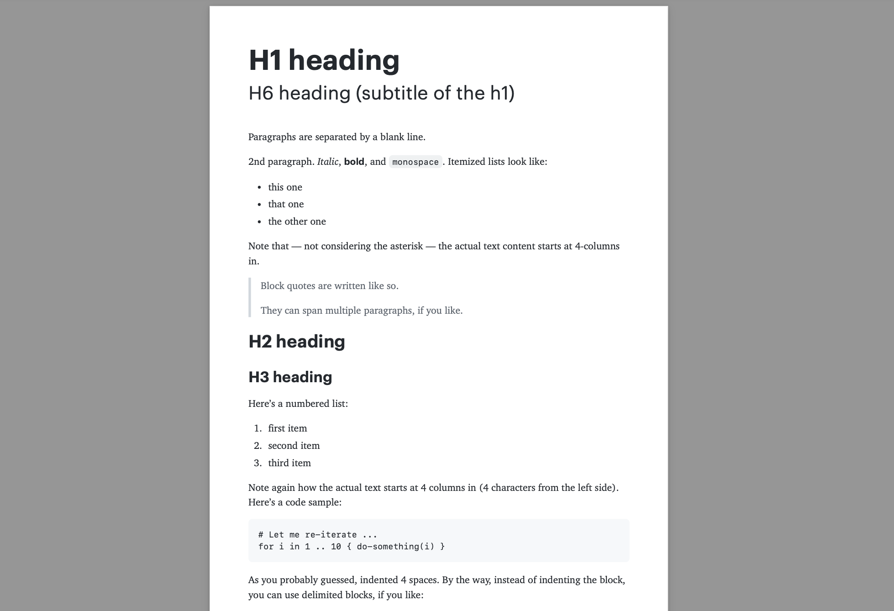

# Journal Template for iA Writer

A clean, typography-focused template optimized for both reading and printing.

## Prerequisites

This template requires the following fonts to be installed on your system:

- [Charter](https://practicaltypography.com/charter.html) - Used for body text
- [Graphik](https://commercialtype.com/catalog/graphik) - Used for headings and bold text

## License

This template is provided under the MIT License. The fonts mentioned are subject to their own respective licenses.